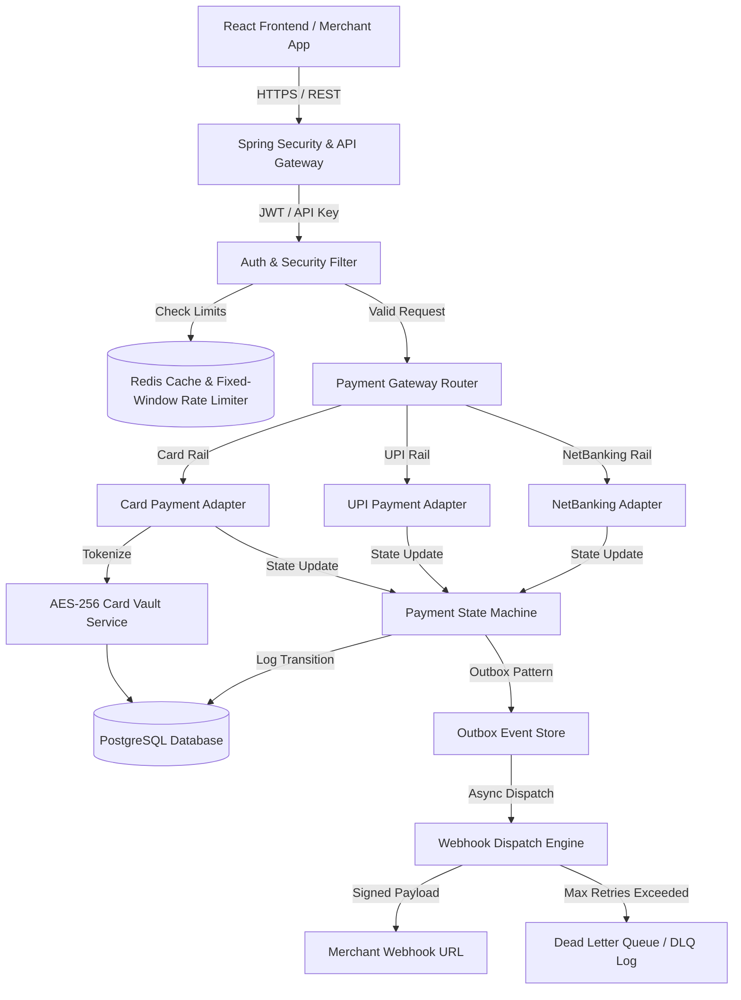
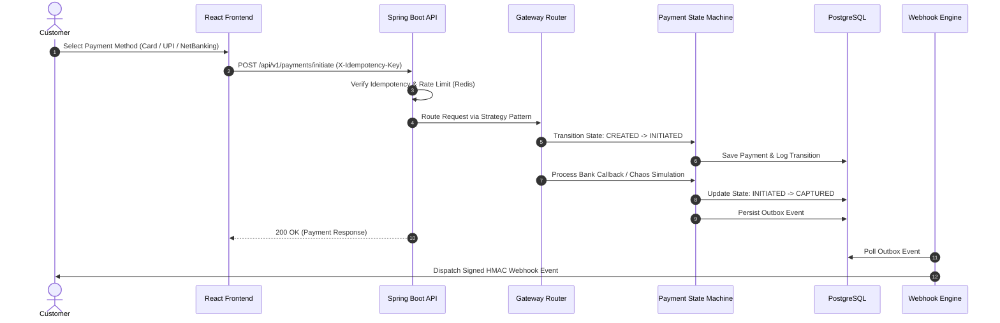
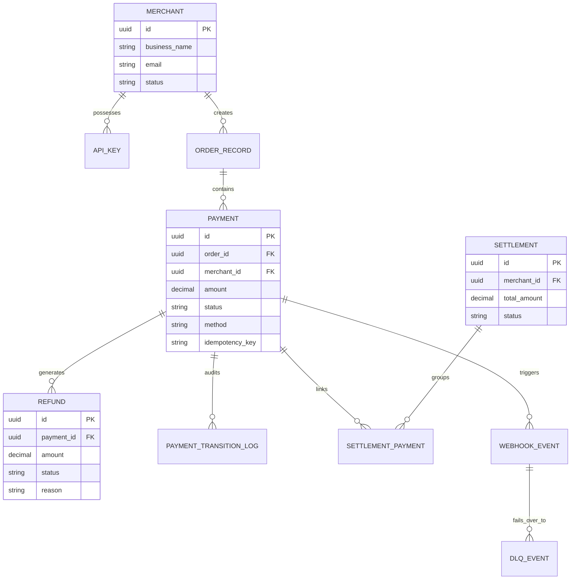

# 💳 Razorpay Clone - Enterprise Full-Stack Payment Gateway & Merchant Portal

[](https://www.oracle.com/java/)
[](https://spring.io/projects/spring-boot)
[](https://react.dev/)
[](https://www.typescriptlang.org/)
[](https://www.postgresql.org/)
[](https://redis.io/)
[](https://tailwindcss.com/)

An enterprise-grade, highly resilient **Full-Stack Payment Gateway and Developer Portal** built to replicate Razorpay's core financial infrastructure. Built with **Spring Boot** on the backend and **React (Vite + Tailwind CSS)** on the frontend, featuring multi-rail payment processing, PCI-DSS style card tokenization, transactional outbox pattern, state machine enforcement, rate limiting, and an interactive chaos payment simulator.

---

## 📸 Merchant Portal & Developer Dashboard

```text
┌─────────────────────────────────────────────────────────────────────────────┐
│                           MERCHANT DEVELOPER PORTAL                         │
├─────────────────┬───────────────────────────────────────────────────────────┤
│ 📊 Dashboard    │  Total Revenue    Success Rate   Active API Keys   DLQ    │
│ 💳 Payments     │  ₹ 2,450,000      98.4%          4                0       │
│ 🔑 API Keys     ├───────────────────────────────────────────────────────────┤
│ 🔔 Webhooks     │  [Initiate Payment Simulator] [Generate API Key]          │
│ ⚙️ Chaos Simulator│                                                           │
└─────────────────┴───────────────────────────────────────────────────────────┘
```

---

## 🏗️ System Architecture & Diagrams

### 1. Component Architecture



### 2. Payment Execution Sequence Diagram



### 3. Database Entity-Relationship (ER) Diagram



---

## ✅ Comprehensive Feature Checklist & Architecture Verification

### 🛡️ Backend Architecture & Core Engine
- [x] **Modular Monolith Architecture**: Strict module boundaries (`common`, `merchant`, `payment`, `operations`, `vault`).
- [x] **Domain-Driven Design (DDD)**: Package structure divided by aggregates, entities, value objects, services, and repositories.
- [x] **Strategy Pattern for Payment Rails**: Pluggable strategies (`CardPaymentProcessor`, `UpiPaymentProcessor`, `NetBankingPaymentProcessor`).
- [x] **Factory & Gateway Router**: Router components (`PaymentProcessorRouter`, `PaymentGatewayRouter`) dynamically delegating payment requests.
- [x] **Deterministic Payment State Machine**: Enforced payment lifecycle (`CREATED` ➔ `INITIATED` ➔ `PROCESSING` ➔ `CAPTURED` / `FAILED` / `REFUNDED` / `SETTLED`).
- [x] **Transaction Transition Audit Logs**: `PaymentTransitionLog` recording every status change, actor, and timestamp.
- [x] **Partial & Multiple Refunds Engine**: `RefundServiceImpl` supporting multiple refunds on a payment while validating cumulative refund limits.
- [x] **Transactional Outbox Pattern**: `OutboxEvent` and `OutboxPublisherService` guaranteeing reliable event emission without distributed transaction bottlenecks.
- [x] **Redis Caching & Rate Limiting**: Multi-strategy limiters (`FixedWindowRateLimiter`, `SlidingWindowRateLimiter`, `TokenBucketRateLimiter`, `RedisApiKeyCache`).
- [x] **Idempotency Engine**: `RedisIdempotencyStore` and `IdempotencyFilter` preventing duplicate payment processing via `X-Idempotency-Key`.
- [x] **Settlement Engine**: Settlement aggregation ledger (`Settlement`, `SettlementPayment`, `SettlementServiceImpl`) grouping captured payments for merchant payouts.
- [x] **Resilient Webhook Engine & DLQ**: Event dispatching with exponential backoff retries and Dead Letter Queue (`DlqEvent`) fallback.
- [x] **Chaos Engineering Bank Simulator**: `BankCallbackSimulator` supporting configurable latency and chaos modes (`NORMAL`, `HIGH_LATENCY`, `BANK_DOWN`).
- [x] **Jakarta Request Validation**: Custom annotations (`@ExpiryYear`, `@Valid`) validating requests before hitting business logic.
- [x] **Global Exception Handling**: `GlobalExceptionHandler` returning structured `ErrorResponse` DTOs with HTTP status mapping.

### 🔒 Security Hardening
- [x] **PCI-DSS Style Card Vault**: AES-256 encryption (`VaultServiceImpl`, `VaultEncryptionConfig`) storing masked card tokens.
- [x] **API Key Secret Hashing**: API secrets hashed with SHA-256 / BCrypt, using prefix lookup (`rzp_test_...`) and Redis caching.
- [x] **JWT Merchant Portal Authentication**: `JwtUtil`, `JwtAuthenticationFilter`, and `MerchantUserDetailsService` securing dashboard endpoints.
- [x] **Webhook SHA-256 HMAC Signatures**: Webhook payloads signed with secret keys to ensure receiver-side authenticity.
- [x] **CORS & Security Filter Chain**: Fine-grained Spring Security policies (`WebSecurityConfig`).
- [x] **Zero Hardcoded Secrets**: Spring `${DB_URL}`, `${JWT_SECRET_KEY}`, `${VAULT_MASTER_KEY}` driven via environment variables.

### 💾 Database Design & Optimization
- [x] **Universal UUID Primary Keys**: All domain entities initialized with `UUID` (`GenerationType.UUID`).
- [x] **B-Tree Database Indexing**: Explicit database indexes on `(order_id)`, `(merchant_id)`, `(status)`, and `(idempotency_key)`.
- [x] **PostgreSQL JSONB Native Columns**: `@JdbcTypeCode(SqlTypes.JSON)` storing flexible payment method details and refund metadata.
- [x] **Embedded Money Value Objects**: `@Embedded Money` enforcing financial currency and subunit precision (paise/INR).

### 🎨 Frontend & Merchant Developer Portal
- [x] **Glassmorphic Developer Dashboard**: Real-time visualization of revenue, success rates, active API keys, and DLQ health (React 18 + Vite + Tailwind).
- [x] **Interactive Checkout Simulator**: Visual checkout modal supporting Card, UPI ID, and NetBanking bank selection.
- [x] **Self-Serve API Key Studio**: Generate, inspect, and revoke API keys with live copy functionality.
- [x] **Webhook & DLQ Inspector**: Monitor webhook logs, HTTP status codes, payload headers, and manual retry options.
- [x] **Settlement & Operations Ledger**: Inspect merchant payouts, status, and linked payment IDs.

### 🧪 Testing & Code Quality
- [x] **Unit Testing Suite**: Service and State Machine tests (`RefundServiceImplTest`, `PaymentStateMachineTest`, `RazorpayApplicationTests`) built with JUnit 5 & Mockito.

---

## 🔌 API Endpoints Summary

| Method | Endpoint | Description | Auth |
| :--- | :--- | :--- | :--- |
| `POST` | `/api/v1/auth/signup` | Register new merchant account | Public |
| `POST` | `/api/v1/auth/login` | Merchant login & JWT retrieval | Public |
| `POST` | `/api/v1/orders` | Create payment order | JWT / API Key |
| `POST` | `/api/v1/payments/initiate` | Initiate payment execution | API Key |
| `POST` | `/api/v1/refunds` | Process partial or full refund | JWT / API Key |
| `POST` | `/api/v1/vault/tokenize` | Tokenize card for vault storage | API Key |
| `GET` | `/api/v1/keys` | List active merchant API keys | JWT |
| `POST` | `/api/v1/keys` | Generate new API secret key | JWT |
| `GET` | `/api/v1/operations/webhooks` | View webhook delivery logs | JWT |
| `GET` | `/api/v1/operations/settlements` | View merchant settlements | JWT |

---

## ⚡ Quick Start & Local Execution

### 1. Start Infrastructure (PostgreSQL & Redis)
```bash
cd Backend
docker-compose up -d
```

### 2. Launch Spring Boot Backend
```bash
cd Backend
./mvnw spring-boot:run
```
> Server runs on `http://localhost:8080`

### 3. Launch React Frontend
```bash
cd ../Frontend
npm install
npm run dev
```
> Web Portal runs on `http://localhost:5173`

---

## 📜 License
This project is open-source under the **MIT License**.
