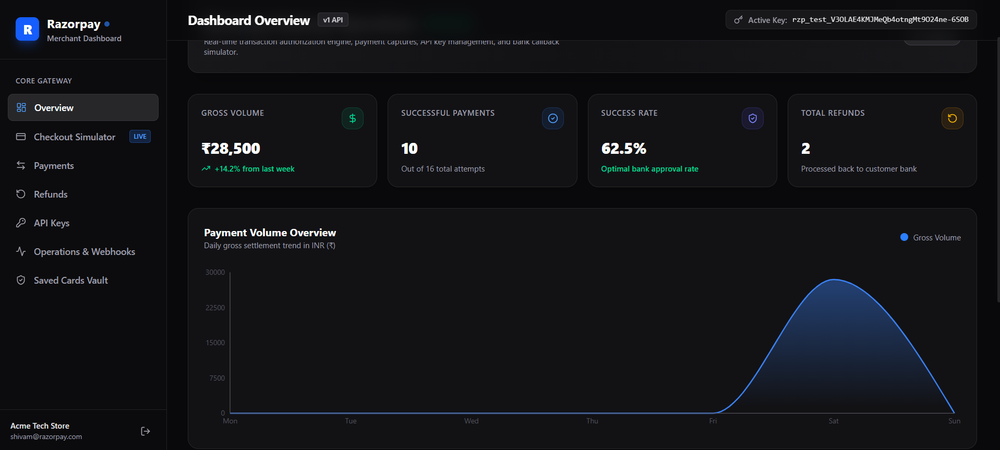
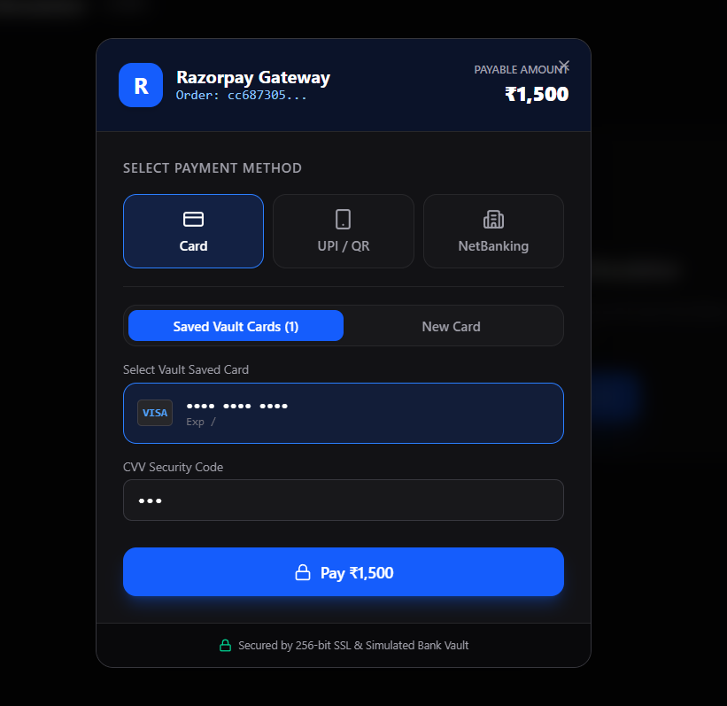
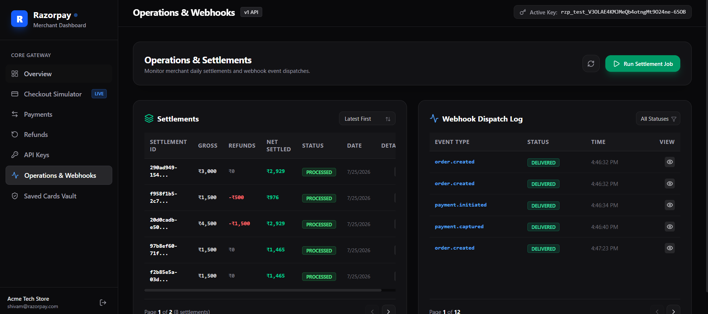
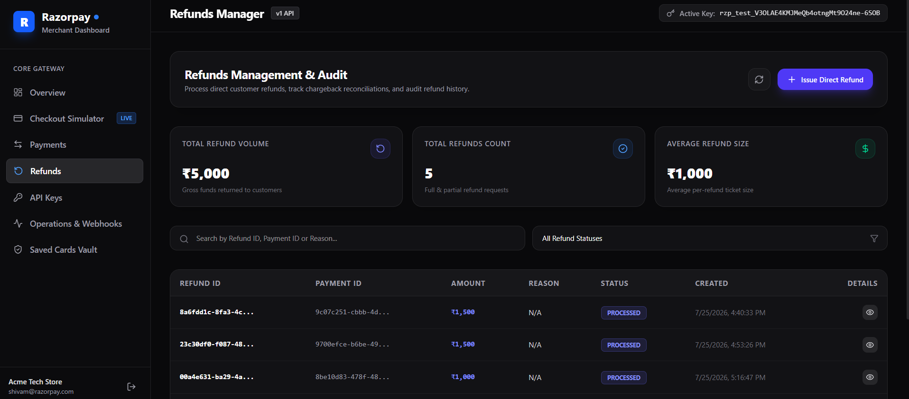
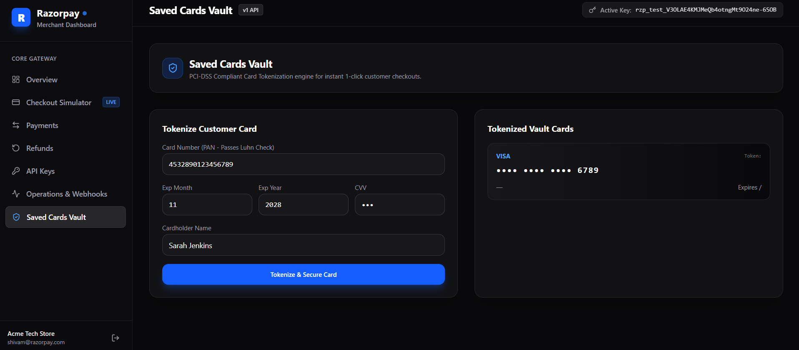
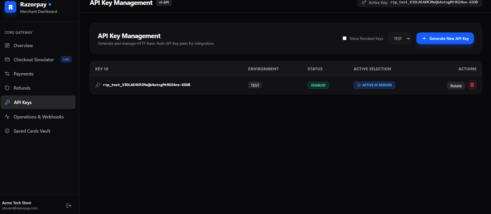
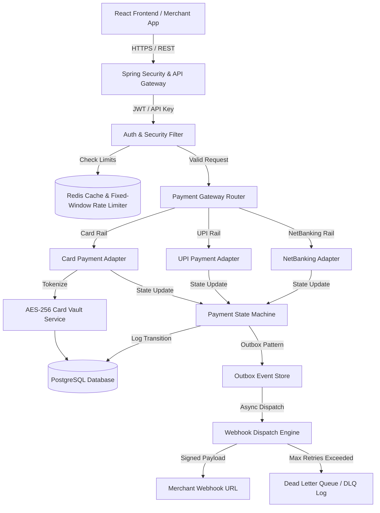
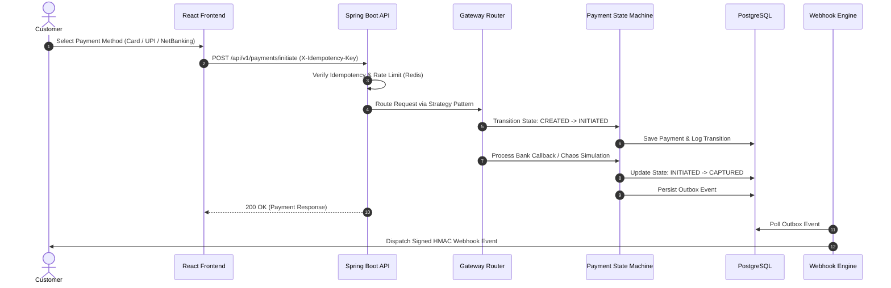

# 💳 Razorpay Clone - Production-Grade Payment Gateway & Merchant Portal

[](https://www.oracle.com/java/)
[](https://spring.io/projects/spring-boot)
[](https://react.dev/)
[](https://www.typescriptlang.org/)
[](https://www.postgresql.org/)
[](https://redis.io/)
[](https://www.docker.com/)
[](LICENSE)

> **💡 Why this project?**
> Built to understand how modern, production-grade payment gateways like Razorpay handle multi-rail payment routing, Redis-backed idempotency, partial refunds, settlement ledgers, PCI-inspired card tokenization, transactional outbox event publishing, and fault tolerance under network chaos.

---

## 📍 Table of Contents
- [App Showcase & UI](#-app-showcase--merchant-portal-ui)
- [Live Demo & Deployment](#-live-demo--deployment)
- [Project Scale & Overview](#-project-scale--structure-overview)
- [Technology Stack](#️-technology-stack-breakdown)
- [Key Architecture Decisions](#-key-architecture-decisions)
- [Engineering Challenges & Solutions](#-engineering-challenges--solutions)
- [System Architecture & Diagrams](#️-system-architecture--diagrams)
- [Repository Directory Structure](#-repository-directory-structure)
- [Cloud Deployment & Environment Variables](#-cloud-deployment--environment-variables)
- [Key Technical Learnings](#-key-technical-learnings)
- [Testing Strategy](#-testing-strategy)
- [Implementation Status & Roadmap](#-implementation-status--honest-roadmap)
- [Quick Start & Local Execution](#-quick-start--local-execution)

---

## 📸 App Showcase & Merchant Portal UI

### 1. Merchant Dashboard Overview

*Real-time merchant metrics showing Gross Volume (₹28,500), Successful Payment attempts, 62.5% bank approval rate, active session API Key (`rzp_test_...`), and settlement trend volume chart.*

### 2. Interactive Payment Gateway Checkout Modal

*Checkout modal supporting Card (with saved vault tokenization), UPI VPA / QR payment rails, NetBanking bank selector, and instant test transaction execution.*

### 3. Operations, Daily Settlements & Webhook Dispatch Logs

*Operations dashboard featuring manual T+0 settlement execution button, Net Settled payout ledger, and live Webhook Event Dispatcher log (`order.created`, `payment.initiated`, `payment.captured`).*

### 4. Refunds Manager & Audit History

*Refund management dashboard showing Total Refund Volume (₹5,000), Direct Refund issuance, search filters, and refund audit trail.*

### 5. PCI-Inspired Saved Cards Vault & Tokenization

*PCI-inspired Card Vault enabling card tokenization (`tok_card_...`), masked PAN storage (`•••• •••• •••• 6789`), Luhn check validation, and 1-click checkout execution.*

### 6. API Key Studio & Environment Management

*Self-serve developer portal for generating HTTP Basic Auth API key pairs (`rzp_test_...`), key rotation, environment filtering (TEST/LIVE), and revoking keys.*

---

## 🌐 Live Demo & Deployment

| Resource | Deployment Status | Local Endpoint |
| :--- | :--- | :--- |
| **Frontend Portal** | 🚧 *Coming Soon* | `http://localhost:5173` |
| **Backend REST API** | 🚧 *Coming Soon* | `http://localhost:8080` |
| **OpenAPI / Swagger** | 🚧 *Coming Soon* | `http://localhost:8080/swagger-ui.html` |

---

## 📊 Project Scale & Structure Overview

| Metric Category | Scope & Design |
| :--- | :--- |
| **Backend Endpoints** | 25+ REST Endpoints (`/orders`, `/payments`, `/refunds`, `/vault`, `/auth`, `/keys`) |
| **Backend Architecture** | 45+ Domain Entities & DTOs \| 15+ Core Services \| 5 Modular Packages |
| **Frontend UI** | 15+ Glassmorphic React Components \| Type-Safe Axios Client \| Tailwind CSS |
| **Idempotency Strategy** | In-Memory / Redis Lock checking `X-Idempotency-Key` headers |
| **Rate Limiting** | Fixed Window, Sliding Window, and Token Bucket limiters backed by Redis |
| **Data Protection** | AES-256-GCM Encryption for tokenized card storage |

---

## 🛠️ Technology Stack Breakdown

| Layer | Technology | Purpose |
| :--- | :--- | :--- |
| **Backend Core** | Java 21 / Spring Boot 3.x | Core REST API, Dependency Injection, JPA Auditing |
| **Database** | PostgreSQL 15 | Persistent storage for Orders, Payments, Refunds, and Audit Logs |
| **Cache & Limits** | Redis | Rate Limiting, Idempotency Key Store, API Key Caching |
| **Security** | Spring Security 6 + JWT + AES-256 | Role-Based Access Control, API Secret Hashing, Card Tokenization |
| **Frontend UI** | React 18 + TypeScript + Vite | Developer Dashboard, Payment Simulator, Glassmorphic UI |
| **Styling** | Tailwind CSS 3.x | Modern responsive layout, dark-mode glassmorphism |
| **Build & Deploy** | Maven / Docker Compose | Containerized local stack for DB & Redis |

---

## 🧠 Key Architecture Decisions

- **Modular Monolith over Microservices**: Selected a modular monolith structure to minimize operational deployment overhead while preserving clean module boundaries (`common`, `merchant`, `payment`, `operations`, `vault`).
- **Redis over In-Memory Cache**: Used Redis for rate limiting and idempotency locks to enable stateless, horizontally scalable API instances.
- **Outbox Pattern over Synchronous Webhooks**: Decouples payment transaction commits from external network I/O, preventing merchant endpoint failures from blocking payment execution.
- **UUIDs over Sequential IDs**: Prevents enumeration attacks and eliminates ID collision risks across distributed database environments.
- **Deterministic State Machine over Enum Updates**: Enforces strict, legal state transitions with mandatory audit logging, preventing invalid status jumps and double-capture bugs.

---

## 💡 Engineering Challenges & Solutions

### 1. Preventing Duplicate Payments via Redis Idempotency
- **Problem**: Network retries or rapid double-clicks can cause duplicate payment processing on the backend.
- **Solution**: Implemented `RedisIdempotencyStore` and `IdempotencyFilter`. Incoming requests carrying `X-Idempotency-Key` lock the transaction context in Redis, returning cached responses for duplicate calls and raising `IdempotencyConflictException` for concurrent executions.

### 2. Reliable Webhook Delivery via Transactional Outbox Pattern
- **Problem**: Dispatching HTTP webhooks directly inside database transactions causes slow response times and risks lost events if the DB commits but network calls fail.
- **Solution**: Implemented the **Transactional Outbox Pattern** (`OutboxEvent` and `OutboxPublisherService`). Payment state changes write outbox events in the same DB transaction. An asynchronous worker polls the outbox, signs payloads with HMAC-SHA256, and dispatches webhooks with exponential backoff.

### 3. Preventing Double-Captures with Payment State Machine
- **Problem**: Invalid status transitions (e.g. attempting to capture an already refunded or failed payment) break ledger accounting.
- **Solution**: Designed a deterministic `PaymentStateMachine` enforcing valid transitions (`CREATED` ➔ `INITIATED` ➔ `PROCESSING` ➔ `CAPTURED` / `FAILED` / `REFUNDED` / `SETTLED`). Illegal jumps trigger `InvalidStateTransitionException` and write audit trails to `PaymentTransitionLog`.

### 4. PCI-Inspired Secure Card Vault Tokenization
- **Problem**: Storing raw credit card numbers in primary databases violates security standards.
- **Solution**: Built `VaultServiceImpl` using AES-256-GCM encryption. Raw card numbers are tokenized (`tok_card_...`), masked (`4111****1111`), and stored securely in `VaultCard`, ensuring application databases only deal with non-sensitive tokens.

### 5. Resilient Event Handling & Dead Letter Queue (DLQ)
- **Problem**: Merchant endpoints may be down or timing out, causing infinite retry loops.
- **Solution**: Configured an exponential backoff retry mechanism. Webhooks exceeding max retries are automatically routed to `DlqEvent` for manual inspection and replay via the Developer Portal.

---

## 🏗️ System Architecture & Diagrams

### 1. Component Architecture


### 2. Payment Execution Sequence Diagram


---

## 📁 Repository Directory Structure

```text
razorpay-clone/
├── Backend/                               # Spring Boot REST API
│   ├── src/main/java/com/dev/razorpay/
│   │   ├── common/                        # Audit, Redis Cache, Rate Limiting, Idempotency
│   │   ├── merchant/                      # Auth, JWT, API Key Management, Merchant Entity
│   │   ├── payment/                       # Strategy Rails, State Machine, Adapters, Simulator
│   │   ├── operations/                    # Webhooks, Settlements, DLQ Event Management
│   │   └── vault/                         # Card Vault, AES-256 Encryption, Tokenization
│   ├── src/main/resources/
│   │   └── application.yaml               # Environment Configuration
│   ├── docker-compose.yml                 # PostgreSQL & Redis Stack
│   └── pom.xml                            # Dependencies
│
├── Frontend/                              # React 18 + Vite + Tailwind App
│   ├── src/
│   │   ├── components/                    # Checkout Modal, Refund Modal, Header, Sidebar
│   │   ├── pages/                         # Dashboard, Payments, API Keys, Webhooks, Operations
│   │   ├── services/                      # Axios API client & Vault Store
│   │   └── types/                         # DTO interfaces
│   ├── package.json
│   └── vite.config.ts
│
├── docs/images/                           # UI Screenshot Assets
└── README.md                              # Main Monorepo Documentation
```

---

## ☁️ Cloud Deployment & Environment Variables

### Recommended 100% Free Hosting Stack

| Component | Cloud Provider | Free Tier Specification |
| :--- | :--- | :--- |
| **PostgreSQL Database** | [Neon.tech](https://neon.tech) | 0.5 GB Free Serverless Postgres |
| **Redis Cache** | [Upstash.com](https://upstash.com) | Free Serverless Redis |
| **Spring Boot Backend** | [Render.com](https://render.com) | Free Web Service (Docker / Maven) |
| **React Frontend** | [Vercel.com](https://vercel.com) | Free Static Hosting |

### Backend Environment Variables (`Render.com`)

| Variable Key | Description | Example / Production Value |
| :--- | :--- | :--- |
| `DB_URL` | PostgreSQL JDBC URL | `jdbc:postgresql://ep-xxx.neon.tech/neondb?sslmode=require` |
| `DB_USER` | Database Username | `neondb_owner` |
| `DB_PASS` | Database Password | `YourNeonPassword123` |
| `REDIS_HOST` | Upstash Redis Hostname | `ep-xxx.upstash.io` |
| `REDIS_PORT` | Redis Port | `6379` |
| `REDIS_PASSWORD` | Upstash Redis Password | `YourUpstashPassword` |
| `JWT_SECRET_KEY` | JWT Signing Key (Base64) | `404E635266556A586E3272357538782F413F4428472B4B6250655368566D5971` |
| `VAULT_MASTER_KEY` | Card Vault Master Key (Base64) | `MDEyMzQ1Njc4OTAxMjM0NTY3ODkwMTIzNDU2Nzg5MDE=` |

### Frontend Environment Variables (`Vercel.com`)

| Variable Key | Description | Example / Production Value |
| :--- | :--- | :--- |
| `VITE_API_BASE_URL` | Live Backend API URL | `https://razorpay-backend.onrender.com` |

---

## 🚀 Key Technical Learnings

- **Building Idempotent Financial APIs**: Designing thread-safe idempotency stores using Redis key locking to handle network retries gracefully.
- **Event-Driven Resilience**: Leveraging the Transactional Outbox pattern and Dead Letter Queues to guarantee event delivery without blocking client threads.
- **Card Security & Tokenization**: Implementing AES-256-GCM encryption workflows to tokenize sensitive payload fields before persistence.
- **Clean Architecture & Design Patterns**: Applying Strategy, Router, State Machine, and DDD patterns to maintain low coupling across payment modules.

---

## 🧪 Testing Strategy

The backend includes isolated unit and integration test coverage:
- **Unit Tests (`JUnit 5` + `Mockito`)**:
  - `PaymentStateMachineTest`: Validates valid vs illegal state transitions (`CREATED` ➔ `CAPTURED`, rejecting `FAILED` ➔ `CAPTURED`).
  - `RefundServiceImplTest`: Validates partial refund calculations and asserts `BusinessRuleViolationException` when refund amount exceeds captured payment.
  - `RazorpayApplicationTests`: Verifies Spring Boot application context startup.

---

## 📌 Implementation Status & Honest Roadmap

### ✅ Verified & Fully Implemented Features
- [x] Multi-Rail Payment Gateway Router (Card, UPI, NetBanking Strategy Pattern)
- [x] Payment State Machine with Audit Logs
- [x] Redis-Backed Idempotency Engine (`X-Idempotency-Key`)
- [x] Multi-Strategy Redis Rate Limiter (Fixed Window, Sliding Window, Token Bucket)
- [x] PCI-Inspired AES-256 Card Vault & Tokenization
- [x] Transactional Outbox Pattern & Webhook Dispatcher
- [x] Dead Letter Queue (DLQ) Inspector & Manual Replay
- [x] Merchant Auth (JWT + Secret API Key Hashing `rzp_test_...`)
- [x] Partial & Multiple Refund Processing
- [x] Settlement Aggregation Ledger
- [x] Bank Chaos Simulator (Latency & Bank Down toggles)
- [x] React Glassmorphic Developer Portal & Checkout Modal

### 🚧 Future Roadmap (Planned Enhancements)
- [ ] Flyway database migration scripts (`V1__init_schema.sql`)
- [ ] Distributed Lock integration via Redisson / Redlock
- [ ] Distributed Tracing with OpenTelemetry / Zipkin
- [ ] Prometheus + Grafana metrics export via Spring Actuator

---

## ⚡ Quick Start & Local Execution

### 1. Start Infrastructure (PostgreSQL & Redis)
```bash
cd Backend
docker-compose up -d
```

### 2. Launch Backend API
```bash
cd Backend
./mvnw spring-boot:run
```
> Server runs on `http://localhost:8080`

### 3. Launch Frontend Portal
```bash
cd ../Frontend
npm install
npm run dev
```
> Web Portal runs on `http://localhost:5173`

---

## 📜 License
This project is open-source under the **MIT License**.
