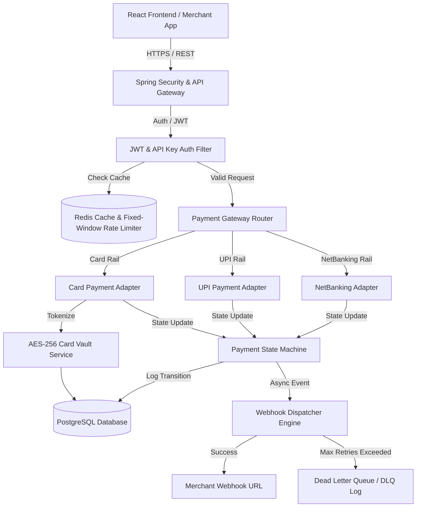

# 💳 Razorpay Clone - Full-Stack Payment Gateway & Merchant Portal

[](https://www.oracle.com/java/)
[](https://spring.io/projects/spring-boot)
[](https://react.dev/)
[](https://www.typescriptlang.org/)
[](https://www.postgresql.org/)
[](https://redis.io/)
[](https://tailwindcss.com/)

A production-grade, highly resilient **Full-Stack Payment Gateway and Developer Portal** modeled after Razorpay's core architecture. Built with **Spring Boot** on the backend and **React (Vite + Tailwind CSS)** on the frontend, featuring multi-rail payment processing, PCI-DSS style card tokenization, an event-driven webhook dispatcher, rate limiting, and an interactive payment simulator.

---

## 📸 System Overview & Dashboard

```
┌─────────────────────────────────────────────────────────────────────────────┐
│                           MERCHANT DEVELOPER PORTAL                         │
├─────────────────┬───────────────────────────────────────────────────────────┤
│ 📊 Dashboard    │  Total Revenue    Success Rate   Active API Keys   DLQ    │
│ 💳 Payments     │  ₹ 2,450,000      98.4%          4                0       │
│ 🔑 API Keys     ├───────────────────────────────────────────────────────────┤
│ 🔔 Webhooks     │  [Initiate Payment Simulator] [Generate API Key]          │
│ ⚙️ Chaos Simulator│                                                           │
└─────────────────┴───────────────────────────────────────────────────────────┘
```

---

## 🏗️ System Architecture



---

## ✨ Key Features & Technical Highlights

### 🛡️ Backend (Spring Boot & PostgreSQL & Redis)
- **Multi-Rail Payment Processing**: Pluggable Strategy pattern supporting **Card**, **UPI**, and **NetBanking** payment execution rails.
- **Strict State Machine Architecture**: Deterministic state transitions (`CREATED` ➔ `INITIATED` ➔ `PROCESSING` ➔ `CAPTURED` / `FAILED` / `REFUNDED`) with transaction-level audit logs to prevent double-capture or invalid state jumps.
- **Card Vault Tokenization (PCI-DSS Style)**: Secure card tokenization using AES-256 encryption, storing masked cards (`4111****1111`) and tokens for recurring or one-click payments.
- **Rate Limiting & Idempotency**: Redis-backed fixed-window rate limiter protecting merchant endpoints, along with idempotency key tracking to eliminate duplicate transaction execution.
- **Resilient Webhook Dispatch Engine**: Asynchronous event listener sending signed HMAC payloads to merchant endpoints with exponential backoff retries and Dead Letter Queue (DLQ) fallback.
- **Bank Callback Simulator with Chaos Engineering**: Configurable chaos modes allowing testing of variable bank latency, network timeouts, and configurable failure rates (UPI 95% success, Card 90%, NetBanking 80%).

### 🎨 Frontend (React + TypeScript + Tailwind CSS)
- **Modern Glassmorphic Developer Dashboard**: Real-time overview of transaction volume, payment conversion rates, API key status, and webhook delivery health.
- **Interactive Checkout & Payment Simulator**: Visual payment checkout modal supporting mock Card, UPI ID, and NetBanking bank selection.
- **API Key & Webhook Configuration Studio**: Self-serve portal for merchants to generate secret API keys and configure webhook notification endpoints.
- **Webhook Logs & DLQ Inspector**: Real-time payload viewer to inspect HTTP request/response headers, signature headers, and retry counts.

---

## 📁 Monorepo Directory Structure

```text
razorpay-clone/
├── Backend/                       # Spring Boot 3.x REST API
│   ├── src/main/java/com/dev/razorpay/
│   │   ├── common/                # Audit, Redis Cache, Rate Limiting, Idempotency
│   │   ├── merchant/              # Auth, JWT, API Key Management, Merchant Entity
│   │   ├── payment/               # Payment Strategies, State Machine, Adapters, Simulator
│   │   ├── operations/            # Webhooks, Settlements, DLQ Event Management
│   │   └── vault/                 # Card Vault, AES Encryption, Tokenization
│   ├── src/main/resources/
│   │   └── application.yaml       # Environment Config & Database Settings
│   ├── docker-compose.yml         # PostgreSQL & Redis Stack setup
│   └── pom.xml                    # Maven Dependencies
│
├── Frontend/                      # React 18 + Vite + Tailwind CSS App
│   ├── src/
│   │   ├── assets/                # Design assets and logos
│   │   ├── components/            # UI components (Navbar, Modals, Tables, Cards)
│   │   ├── context/               # Auth & App State Context
│   │   ├── pages/                 # Dashboard, Payments, API Keys, Webhooks, Simulator
│   │   ├── services/              # Axios API service client
│   │   └── types/                 # TypeScript DTO Interfaces
│   ├── package.json               # Node dependencies
│   └── vite.config.ts             # Vite Configuration
│
└── README.md                      # Unified Monorepo Documentation
```

---

## ⚡ Quick Start & Local Setup

### Prerequisites
- **Java 17+** & **Maven 3.8+**
- **Node.js 18+** & **npm**
- **Docker & Docker Compose** (for PostgreSQL & Redis)

### 1. Start Infrastructure (PostgreSQL & Redis)
```bash
cd Backend
docker-compose up -d
```

### 2. Launch Backend API
```bash
cd Backend
./mvnw spring-boot:run
```
> The API server will start on `http://localhost:8080`

### 3. Launch Frontend Portal
```bash
cd ../Frontend
npm install
npm run dev
```
> The web dashboard will start on `http://localhost:5173`

---

## 🔒 Security & Best Practices

- **Zero Hardcoded Secrets**: All sensitive keys (Database passwords, Redis passwords, Vault Master Key, JWT Secret) are driven via environment variables (`${DB_USER}`, `${JWT_SECRET_KEY}`).
- **HMAC Signature Verification**: Webhook payloads are signed with SHA-256 HMAC digest to ensure payload integrity at the merchant receiver endpoint.
- **Role-Based Access Control**: Spring Security filters enforcing JWT authorization for merchant portal APIs and API Key auth for server-to-server checkout calls.

---

## 📜 License
This project is open-source under the MIT License.
